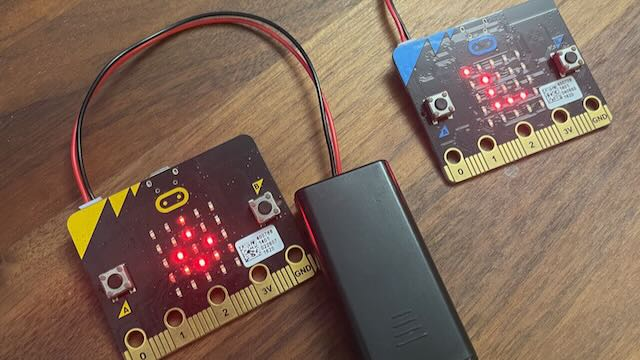

We’ve now completed our first full term since CoderDojo restarted at the Bishops Cleeve Library.  It’s been wonderful to have the club up and running again, and to have had so many people join us to learn about coding.  A big thank you to everyone who joined us throughout the autumn!

## The term in numbers

* 113 spaces were booked over the 8 club sessions
* 70% of attendees enjoyed it so much that they came back for more
* We had an almost even gender split, with girls making up 45% of the attendees

## What we made

Many of the ninjas spent this year working through the [Introduction to Scratch learning path](https://projects.raspberrypi.org/en/pathways/scratch-intro).

We saw some incredibly creative interpretaions of these projects.  Here a just a few of the things which were made this term:

#### Funny animations
<iframe src="https://scratch.mit.edu/projects/736406497/embed" allowtransparency="true" width="485" height="402" frameborder="0" scrolling="no" allowfullscreen></iframe>

[View the code](https://scratch.mit.edu/projects/736406497)

#### Lots of crazy eyes
<iframe src="https://scratch.mit.edu/projects/764448338/embed" allowtransparency="true" width="485" height="402" frameborder="0" scrolling="no" allowfullscreen></iframe>

[View the code](https://scratch.mit.edu/projects/764448338)

#### Surprise animations!
<iframe src="https://scratch.mit.edu/projects/771477314/embed" allowtransparency="true" width="485" height="402" frameborder="0" scrolling="no" allowfullscreen></iframe>

[View the code](https://scratch.mit.edu/projects/771477314/)

You can find more of the projects we've created in [our Scratch studio](https://scratch.mit.edu/studios/32126251).  If you'd like to share anything which was done this term, feel free to add to the collection!

## Treasure Hunt

As well as Scratch, we also had some ninja's trying out programming the tiny [Micro:bit computer](https://microbit.org/).  

We finished off the year with a Christmas treasure hunt using the Micro:bit's radios - with one acting as a "finder" and other's hidden aronud the library broadcasting a signal so they can be found.

If you'd like to see the code behind the treasure hunt, you can view it on [our GitHub page](https://github.com/Bishops-Cleeve-CoderDojo/christmas-microbit-trail).

The library has kindly supplied us with another batch of micro bits and hardware kits, so there will be much more of this sort of thing in the new year!  Remember you can also borrow a micro:bit from the library - look for the kits in the children's section.

## Thanks, and happy new year!

Finally, none of this would be possible without our great group of volunteers, who generously give up their time and share their knowledge, and also the Bishops Cleeve Library who put up with our craziness every two weeks!  Huge thanks to them all!

Wishing you all a very happy 2023, full of lots of coding!

