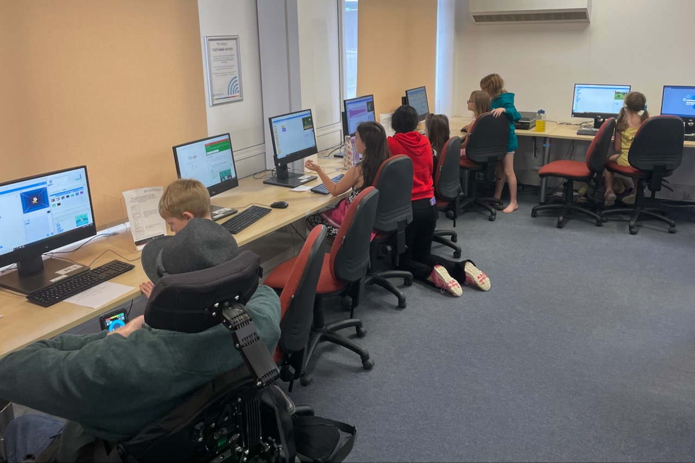
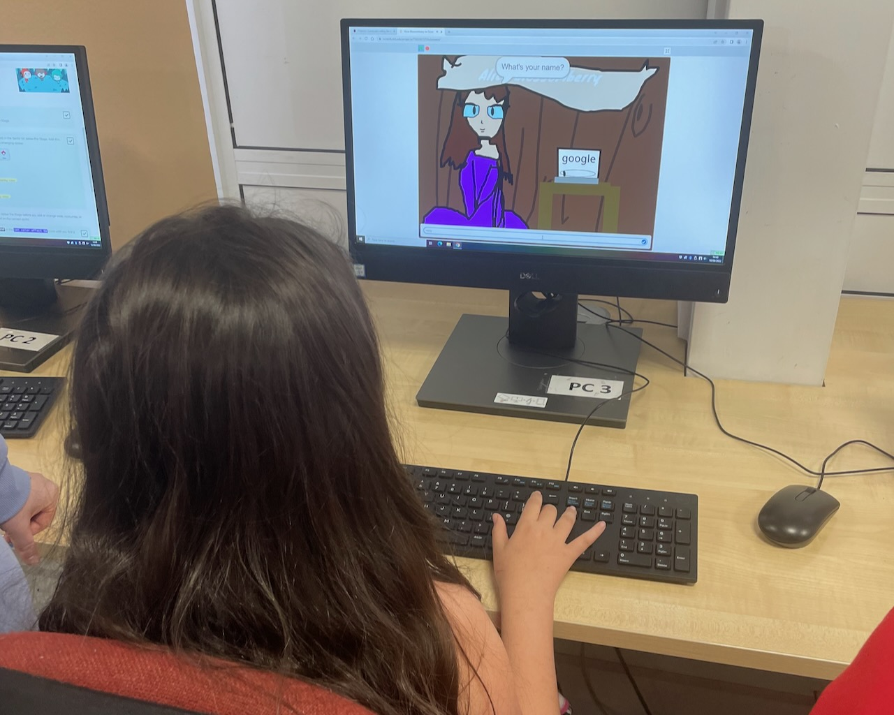

We had a fantastic first session back at the Bishops Cleeve CoderDojo yesterday, with the children showing off some great creativity and Scratch coding skills. The mentors and I were all really impressed!

This was our first session following the [learning paths](https://projects.raspberrypi.org/en/paths), and most children started with the Introduction to Scratch path.

The first project involves creating talking characters. We had a princess floating off into space, a dog waking up its owner who had fallen asleep in the park as well as a snowman melting on the beach (with some great melting animation!), and finally a beautifully hand-drawn character who told randomly generated stories.

Tickets are now available for the next sessions,
[book your free place now](https://zen.coderdojo.com/dojos/gb/cheltenham/bishops-cleeve-bishops-cleeve-library)!